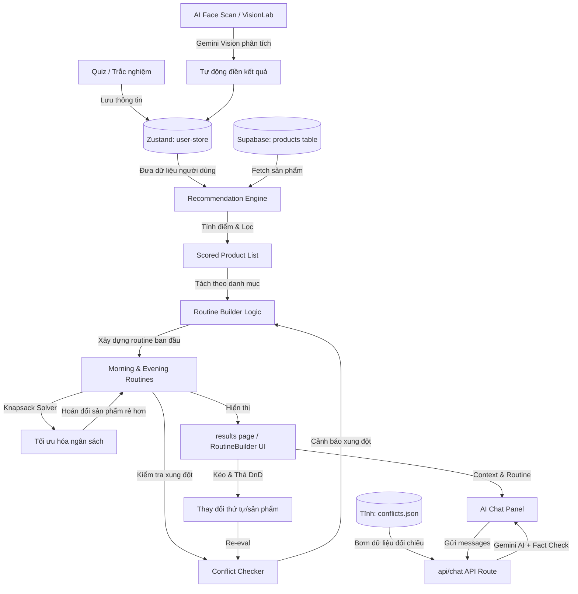

# 🏗️ SkinWise System Architecture & Component Overview

Tài liệu này cung cấp cái nhìn chi tiết và chuyên sâu về cấu trúc hệ thống, các thuật toán cốt lõi, luồng dữ liệu và tích hợp trí tuệ nhân tạo (AI) của ứng dụng **SkinWise**.

---

## 🗺️ Tổng quan Luồng Dữ liệu (Data Flow)

Dưới đây là sơ đồ kiến trúc luồng dữ liệu từ khi người dùng bắt đầu làm Quiz hoặc quét da cho đến khi nhận được Routine tối ưu và trò chuyện với Trợ lý AI:



---

## 🧠 Các Thành phần Cốt lõi (Core Components)

### 1. Thuật toán Đánh giá Độ phù hợp (Recommendation Engine)
Nằm tại `src/lib/recommendation-engine.ts`, hàm `calculateMatchScore` đánh giá độ tương thích của một sản phẩm đối với hồ sơ da (`UserProfile`) của người dùng trên thang điểm **100**. Điểm số này bao gồm 6 tiêu chí:

| Tiêu chí | Trọng số tối đa | Mô tả chi tiết thuật toán |
|---|---|---|
| **Loại da & Thành phần tránh** | **30 điểm** | - **20 điểm** nếu sản phẩm hỗ trợ loại da của người dùng (hoặc hỗ trợ `"all"`).<br>- **10 điểm** nếu sản phẩm **không chứa** các chất muốn tránh (alcohol, fragrance, silicone) được cấu hình trong profile. |
| **Vấn đề về da (Concerns)** | **25 điểm** | Điểm số được chia tỷ lệ dựa trên số lượng vấn đề da của người dùng được sản phẩm giải quyết (ví dụ: mụn, lỗ chân lông, thâm nám, lão hóa, xỉn màu, khô ráp). |
| **Môi trường & Kết cấu** | **20 điểm** | - **10 điểm** nếu kết cấu trùng sở thích người dùng (Gel/Cream).<br>- Thêm **10 điểm** nếu kết cấu phù hợp môi trường: nóng ẩm thích hợp dạng Gel mỏng nhẹ; phòng điều hòa/khô lạnh thích hợp dạng Cream dưỡng sâu. |
| **Ngân sách (Budget)** | **15 điểm** | Trọn vẹn **15 điểm** nếu giá sản phẩm nằm trong khoảng ngân sách người dùng chọn. Nếu vượt, sản phẩm vẫn được giữ nhưng nhận 0 điểm ở phần này kèm ghi chú nhắc nhở. |
| **Hoạt chất mạnh (Actives)** | **10 điểm** | - Kiểm tra các hoạt chất mạnh (Retinol, Tretinoin, AHA, BHA, Glycolic Acid).<br>- **Phạt (-10 điểm)** nếu da đang có hàng rào bảo vệ yếu (đỏ rát, bong tróc) hoặc người dùng không muốn dùng hoạt chất mạnh nhằm bảo vệ an toàn cho da. |
| **Chu kỳ kinh nguyệt (Menstrual Cycle)** | **Điều chỉnh (+/-)** | - **Luteal Phase (Pha hoàng thể)**: Cộng điểm (+8) cho sản phẩm kiềm dầu, trị mụn (BHA, đất sét, tràm trà) và (+4) cho kết cấu lỏng nhẹ.<br>- **Menstrual Phase (Pha hành kinh)**: Cộng điểm (+8) cho hoạt chất phục hồi, làm dịu (B5, rau má, ceramide); Phạt nặng (-10) cho các hoạt chất peel da mạnh. |

---

### 2. Bộ dựng Quy trình & Tối ưu hóa Ngân sách (Routine Builder & Knapsack Solver)
Nằm tại `src/lib/quiz-logic.ts`, hàm `buildInitialRoutine` thực hiện nhiệm vụ tự động lắp ráp quy trình chăm sóc da sáng (AM) và tối (PM):

*   **Xây dựng Routine ban đầu theo mức độ phức tạp & Sức khỏe làn da**:
    *   Nếu hàng rào bảo vệ da yếu (đang bị rát, bong tróc, mẩn đỏ): Hệ thống **bắt buộc** áp dụng quy trình **tối giản (minimal)** (chỉ Cleanser $\rightarrow$ Moisturizer $\rightarrow$ Sunscreen) để phục hồi da, bất kể người dùng ban đầu chọn quy trình phức tạp.
    *   Quy trình **Balanced**: Thêm Toner hoặc Serum phù hợp loại da/vấn đề da.
    *   Quy trình **Complete**: Đầy đủ các bước từ làm sạch, toner, serum đặc trị, tẩy tế bào chết hóa học (exfoliant), khóa ẩm, bảo vệ.
*   **Giải thuật tối ưu hóa ngân sách (Knapsack Optimization Solver)**:
    *   Hệ thống tính tổng chi phí của tất cả các sản phẩm độc bản (unique) trong cả hai routine AM & PM.
    *   Nếu tổng chi phí vượt quá hạn mức ngân sách của phân khúc người dùng (ví dụ: Học sinh - Sinh viên $\le$ 650k, Bình dân $\le$ 1.3tr, Tầm trung $\le$ 3.5tr, Cận cao cấp $\le$ 9.0tr):
    *   Thuật toán sẽ chạy vòng lặp tối đa 15 lần. Ở mỗi vòng lặp, nó duyệt qua các vị trí trong routine và tìm sản phẩm thay thế cùng loại nhưng có mức giá rẻ hơn $\rightarrow$ tính toán tỷ lệ:
        $$\text{Ratio} = \frac{\Delta \text{Score (Điểm bị giảm)}}{\Delta \text{Price (Số tiền tiết kiệm được)}}$$
    *   Sản phẩm có tỉ lệ nhỏ nhất (tiết kiệm nhiều tiền nhất nhưng giảm ít điểm hiệu quả nhất) và không gây xung đột nghiêm trọng mới sẽ được chọn để thế chỗ.

---

### 3. Bộ kiểm tra Xung đột Thành phần & Kết cấu (Conflict Checker)
Nằm tại `src/lib/conflict-checker.ts`, hệ thống quét định kỳ routine hiện tại để phát hiện các rủi ro tổn thương da hoặc hỏng kết cấu mỹ phẩm:

1.  **Xung đột Hoạt chất (Ingredient Conflicts)**:
    *   Đối chiếu chéo bảng thành phần của các sản phẩm đang có trong routine với cơ sở dữ liệu `conflicts.json`.
    *   Phát hiện các cặp kỵ nhau như: AHA + Retinol, Vitamin C + Retinol, BHA + Benzoyl Peroxide (ở mức cảnh báo tương ứng: High, Medium, Low) và đưa ra giải pháp (ví dụ: dùng giãn cách ngày, tách biệt AM/PM).
2.  **Xung đột Kết cấu gây vón cục (Texture Conflicts & Pilling Risk)**:
    *   Phát hiện việc kết hợp quá nhiều sản phẩm cùng kết cấu dày hoặc các chất tạo màng kỵ nhau gây hiện tượng vón cục phấn/kem khi thoa lên mặt.
3.  **Quy tắc Đảo ngược Nước - Dầu (Water-Silicone Layering Asymmetry)**:
    *   Sản phẩm gốc nước (Water-based) bôi sau sản phẩm gốc dầu/silicone (Silicone-based) sẽ bị ngăn chặn hấp thụ và gây vón cục nghiêm trọng do màng silicone chặn đường.
    *   Hệ thống kiểm tra thứ tự bôi dựa trên danh mục (`layeringOrder`): Nếu phát hiện một sản phẩm gốc nước đứng sau sản phẩm gốc silicone trong routine, hệ thống sẽ kích hoạt cảnh báo nguy hiểm độ nghiêm trọng **High**.

---

## 🤖 Tích hợp Trí tuệ Nhân tạo (Gemini AI Services)

SkinWise tích hợp mô hình **Gemini 2.5 Flash** cho ba tính năng tương tác chính thông qua các API chuyên biệt:

```
src/app/api/
├── chat/                   # Trợ lý tư vấn da liễu cá nhân (Streaming Chat)
│   └── route.ts            
└── vision/                 # Dịch vụ phân tích hình ảnh AI
    ├── analyze/route.ts    # AI Face Scan (Phân tích ảnh mặt tự động điền Quiz & Check-in)
    └── scan/route.ts       # AI Product Scanner (Quét nhãn chai, phân tích thành phần & check xung đột)
```

### A. AI Chat Advisor (`/api/chat`)
*   **Cơ chế hoạt động**: Sử dụng `@google/generative-ai` để tạo phản hồi streaming (sendMessageStream).
*   **Fact-check Injection**: Để tránh hiện tượng ảo tưởng (hallucination) của AI về mỹ phẩm, tại thời điểm nhận request, API Route sẽ đọc file dữ liệu gốc `data/conflicts.json` và hồ sơ da hiện tại của người dùng (`userContext`), sau đó bơm trực tiếp vào `systemInstruction`.
*   **Luật phản hồi**: AI bắt buộc phải cảnh báo kèm thẻ `[AI WARNING]` đầu dòng nếu phát hiện người dùng hỏi về một routine có chứa xung đột hoạt chất thực tế, chỉ trả lời các nội dung liên quan chăm sóc da bằng tiếng Việt điềm đạm.

### B. AI Face Scan (`/api/vision/analyze`)
*   **Cơ chế hoạt động**: Sử dụng SDK AI của Vercel (`generateObject`) kết hợp Zod schema để trả về cấu trúc dữ liệu JSON chặt chẽ từ ảnh chụp selfie của người dùng.
*   **Chế độ hoạt động**:
    1.  **Quiz Mode**: Phân tích ảnh chụp mặt lúc làm trắc nghiệm ban đầu để nhận diện: `skinType` (Oily, Dry, Combination, Normal), các vấn đề da `concerns`, độ nghiêm trọng của mụn (Acne), mẩn đỏ (Redness), lỗ chân lông (Pores), và kết cấu da (Texture) thang điểm từ 0-100.
    2.  **Daily Check-in Mode**: Ước lượng 5 chỉ số da thay đổi theo ngày (thang điểm 1-5): `oiliness`, `dryness`, `redness`, `acne`, và `barrierComfort` (sức khỏe hàng rào bảo vệ da) để vẽ biểu đồ theo dõi tình trạng da theo thời gian cho người dùng.

### C. AI Product Scanner (`/api/vision/scan`)
*   **Cơ chế hoạt động**: Người dùng chụp ảnh mặt sau của chai mỹ phẩm chứa bảng thành phần (Ingredients List).
*   **Trích xuất & Ánh xạ**:
    1.  Mô hình thực hiện OCR đọc văn bản thô từ ảnh.
    2.  So khớp các hoạt chất đọc được với danh sách ID thành phần được hệ thống quản lý (`KNOWN_INGREDIENT_IDS` trong database).
    3.  Nhận diện xem sản phẩm là gốc nước hay gốc silicone bằng cách kiểm tra các thành phần đứng đầu bảng thành phần.
    4.  Xác định phân loại danh mục (Cleanser, Serum, Sunscreen, Makeup...).
*   **Kiểm tra xung đột thời gian thực**: Trả về một đối tượng chứa thông tin sản phẩm tạm thời, đồng thời chạy kiểm tra xung đột trực tiếp giữa sản phẩm vừa quét với routine AM và PM hiện tại của người dùng để trả lời ngay: *"Sản phẩm này có an toàn để thêm vào routine của bạn không?"*.

---

## 🗄️ Cấu trúc Cơ sở Dữ liệu (Supabase Schema)

Hệ thống lưu trữ dữ liệu tại PostgreSQL trên Supabase với Row Level Security (RLS) được bật mặc định (Người dùng public chỉ được đọc `SELECT`, chỉ admin mới được chỉnh sửa `INSERT/UPDATE/DELETE`):

```
                                  +-----------------------+
                                  |      ingredients      |
                                  +-----------------------+
                                  | id (PK) - text        |
                                  | name - text           |
                                  | name_vi - text        |
                                  | category - text       |
                                  | benefits - text[]     |
                                  | skin_types - text[]   |
                                  | conflicts_with -text[]|
                                  +-----------------------+
                                              | 1
                                              |
                                              | 1..*
                              +-------------------------------+
                              |      product_ingredients      |
                              +-------------------------------+
                              | product_id (FK) - text        |
                              | ingredient_id (FK) - text     |
                              +-------------------------------+
                                              | *
                                              |
                                              | 1
                                    +-------------------+
                                    |     products      |
                                    +-------------------+
                                    | id (PK) - text    |
                                    | name - text       |
                                    | brand - text      |
                                    | price - numeric   |
                                    | type - text       |
                                    | category - text   |
                                    | skin_types -text[]|
                                    | concerns - text[] |
                                    | texture - text    |
                                    | image - text      |
                                    | is_water_based    |
                                    | is_silicone_based |
                                    +-------------------+
```

---

## ⚠️ Nợ Kỹ thuật & Điểm cần Cải thiện (Known Asymmetry & Tech Debt)

Hiện tại, hệ thống vẫn đang trong quá trình chuyển dịch từ phiên bản MVP (sử dụng dữ liệu tĩnh cục bộ) sang phiên bản Production hoàn chỉnh. Do đó tồn tại một số điểm bất cân xứng cần lưu ý:

1.  **Asymmetry ở Conflict Checker**:
    *   Hàm `checkConflicts` vẫn đang đọc thông tin xung đột từ file JSON tĩnh `src/data/conflicts.json` thay vì truy vấn trực tiếp bảng `rules` trên database Supabase. Điều này giúp tối ưu tốc độ kiểm tra client-side nhưng yêu cầu developer phải cập nhật đồng bộ cả hai nơi khi bổ sung luật mới.
2.  **Trang Từ điển Thành phần (`/ingredients`)**:
    *   Trang này vẫn đang đọc trực tiếp file JSON cục bộ `src/data/ingredients.json` thay vì gọi API/Supabase Client để lấy danh sách từ bảng `ingredients`.
3.  **Local Helper của component `VisionLab.tsx`**:
    *   Component phân tích da này tự định nghĩa hàm tiện ích `clsx` riêng thay vì import từ file dùng chung `src/lib/utils.ts`.
4.  **Cơ chế Cache điểm số AI**:
    *   Điểm số phù hợp sản phẩm được cache trong `sessionStorage` theo key ghép giữa `product.id` và `skinType`. Nếu người dùng cập nhật vấn đề da (concerns) trong phiên làm việc hiện tại, điểm số cũ có thể không được tính toán lại ngay lập tức cho đến khi mở tab mới hoặc xóa cache.
