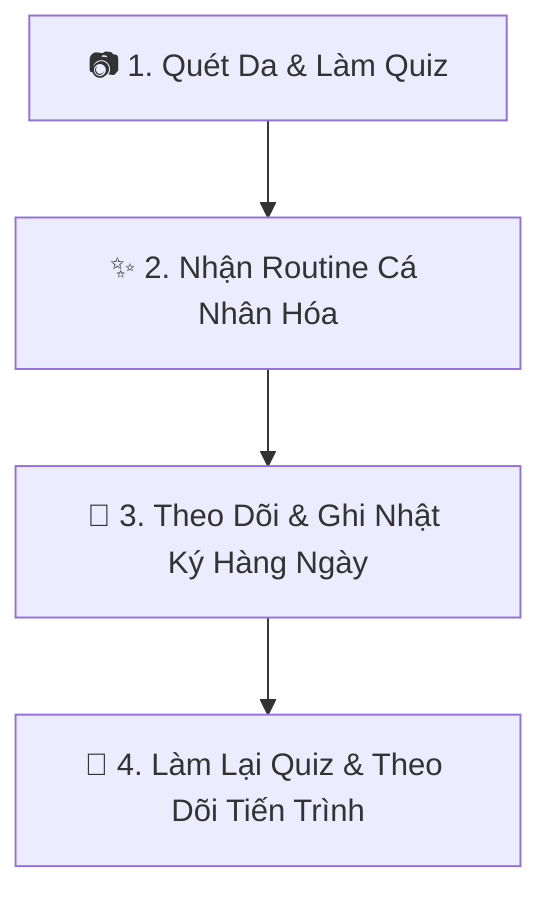

# 🌸 SkinWise — Người Bạn Đồng Hành Chăm Sóc Da Thông Minh

Chào mừng bạn đến với **SkinWise**, trợ lý AI cá nhân giúp bạn thiết kế quy trình chăm sóc da khoa học, an toàn và tối ưu chi phí. 

Nếu bạn từng bối rối trước hàng ngàn loại mỹ phẩm trên thị trường, lo lắng các hoạt chất kích ứng nhau, hay phân vân không biết sản phẩm nào thực sự hợp với túi tiền của mình – **SkinWise sinh ra là để dành cho bạn.**

---

## 🚀 Trải Nghiệm Khách Hàng (User Journey) Trong 4 Bước

### 1. Quét gương mặt và làm trắc nghiệm nhanh (AI Quiz)
* **Phân tích da thông minh:** Bạn có thể tự chọn loại da hoặc chỉ cần chụp một tấm hình selfie, AI (sử dụng công nghệ Gemini Vision) sẽ phân tích bề mặt da để nhận diện mụn, thâm, mẩn đỏ và loại da hiện tại của bạn.
* **Xác định mong muốn & Ngân sách:** Bạn chọn những vấn đề muốn tập trung cải thiện nhất và cài đặt hạn mức chi tiêu để AI đề xuất sản phẩm phù hợp ví tiền của bạn nhất.

### 2. Nhận Chu trình chăm sóc da hoàn chỉnh (AM/PM Routine)
* **Quy trình chuẩn khoa học:** Bạn sẽ nhận được chu trình dưỡng da buổi sáng (AM) và buổi tối (PM) được sắp xếp đúng thứ tự sử dụng chuẩn da liễu.
* **Tự do tùy biến:** Bạn có thể dễ dàng hoán đổi, thay thế các sản phẩm gợi ý bằng các sản phẩm khác tương đương hoặc thêm sản phẩm bạn đang dùng sẵn ở nhà vào chu trình.
* **Tích hợp mua sắm nhanh:** Liên kết trực tiếp đến các shop chính hãng trên Shopee để bạn yên tâm mua sắm không lo hàng giả.

### 3. Đồng hành và ghi chép hàng ngày (Daily Workspace)
* **Nhật ký làn da (Skin Journal):** Chụp ảnh selfie mỗi ngày, chấm điểm các chỉ số của da (độ ẩm, độ mịn, mụn, mẩn đỏ) để theo dõi tiến trình hồi phục trực quan.
* **Theo dõi chu kỳ (Cycle Predictor):** Dự đoán các giai đoạn nhạy cảm của làn da theo chu kỳ sinh học của phái đẹp và đưa ra các mẹo điều chỉnh phù hợp.
* **Chế độ Phục hồi (Recovery Mode):** Nếu da bạn đột ngột bị kích ứng hoặc dị ứng thời tiết, chỉ cần 1 nút bấm, hệ thống sẽ tự động tạm ẩn các hoạt chất mạnh (như Retinol, BHA, Vitamin C) và hướng dẫn bạn dưỡng da dịu nhẹ cho đến khi da khỏe lại.

### 4. Cập nhật và so sánh cải tiến da (Quiz Retake & Comparison)
* Làn da của bạn sẽ thay đổi theo thời gian, thời tiết và thói quen sinh hoạt. Khi cảm thấy da đã cải thiện hoặc chuyển mùa, bạn có thể thực hiện **Làm lại Quiz**.
* Hệ thống sẽ tự động so sánh chi tiết trước và sau: Loại da thay đổi ra sao? Mức độ nhạy cảm giảm thế nào? Bạn có thể so sánh và lựa chọn giữ lại routine cũ hay cập nhật routine mới.

---

## 💡 Các Tính Năng Độc Đáo Chỉ Có Tại SkinWise

### 🧪 Phòng Thí Nghiệm An Toàn (Safety Lab)
Không còn nỗi lo kết hợp sai hoạt chất gây kích ứng (ví dụ: dùng chung Retinol và BHA nồng độ cao). Safety Lab sẽ quét toàn bộ routine của bạn và đưa ra cảnh báo:
* 🔴 **Đỏ (Nguy hiểm):** Hoạt chất xung đột mạnh, dễ gây bong tróc, cháy da.
* 🟡 **Vàng (Cảnh báo):** Cần lưu ý giãn cách thời gian sử dụng hoặc dưỡng ẩm kỹ.
* 🟢 **Xanh (An toàn):** Các sản phẩm kết hợp hài hòa, nâng đỡ hiệu quả cho nhau.

### 💬 Cố Vấn AI 24/7 (AI Advisor)
Bất cứ khi nào bạn băn khoăn về da liễu, bạn có thể chat trực tiếp với Cố vấn AI:
* *"Sản phẩm này bà bầu dùng được không?"*
* *"Da đang bong tróc thì nên dùng kem dưỡng nào?"*
* *"Thứ tự thoa Serum Vitamin C và Niacinamide như thế nào?"*
AI sẽ trả lời bạn tức thì với những lời khuyên khoa học và dễ hiểu nhất.

---

## 🛡️ Khuyến Cáo An Toàn Cho Làn Da
> [!IMPORTANT]
> Công nghệ AI của SkinWise phân tích dựa trên dữ liệu thành phần khoa học được kiểm chứng. Tuy nhiên, cơ địa mỗi người là độc nhất vô nhị.
> * Luôn thử sản phẩm mới lên một vùng da nhỏ (sau tai hoặc quai hàm) từ 24 - 48 giờ trước khi bôi toàn mặt.
> * Nếu da xuất hiện dấu hiệu ngứa rát, nổi mẩn đỏ nghiêm trọng, hãy ngưng sử dụng ngay và tham khảo ý kiến bác sĩ chuyên khoa da liễu.

*Chúc bạn luôn tự tin và sở hữu làn da rạng rỡ cùng SkinWise!*
