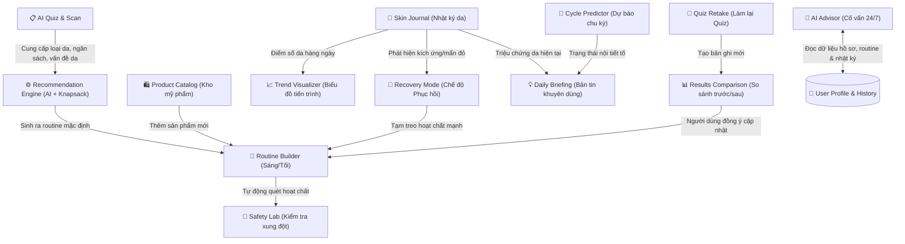

# 🗺️ Bản Đồ Tính Năng & Luồng Trải Nghiệm Người Dùng (SkinWise Product Flow)

Chào mừng bạn đến với tài liệu phân tích chuyên sâu về cách các tính năng của **SkinWise** vận hành và liên kết chặt chẽ với nhau để tạo ra một hệ sinh thái chăm sóc da thông minh, tự động hóa và liền mạch.

---

## 1. Sơ Đồ Liên Kết Giữa Các Tính Năng (Feature Interconnection)

Dưới đây là cách các bộ phận cốt lõi của SkinWise "nói chuyện" và truyền dữ liệu cho nhau để phục vụ bạn:

---

## 2. Luồng Người Dùng Chi Tiết (Step-by-Step User Journey)

Hành trình của bạn trên SkinWise được chia thành 3 giai đoạn chính: **Khởi động (Onboarding)**, **Vận hành hàng ngày (Daily Loop)**, và **Đánh giá & Nâng cấp (Optimization Loop)**.

---

### Giai Đoạn 1: Khởi Động & Nhận Giải Pháp (Onboarding)

#### Bước 1.1: Quét Da và Khảo Sát (AI Quiz & Scan)
*   **Trải nghiệm:** Bạn trả lời các câu hỏi về độ tuổi, vấn đề da (mụn, nhạy cảm, lão hóa), và đặt hạn mức chi tiêu (ngân sách). 
*   **Tính năng AI Face Scan:** Bạn có thể bật camera để AI phân tích ảnh selfie trực tiếp, tự động nhận dạng loại da và các vùng khuyết điểm để điền vào Quiz.

#### Bước 1.2: Phân Tích & Sinh Chu Trình (Recommendation Engine)
*   **Cách hoạt động:** Thuật toán thông minh sẽ lấy dữ liệu từ Quiz, đối chiếu với bách khoa toàn thư hoạt chất, sử dụng toán học (thuật toán tối ưu hóa) để chọn ra bộ sản phẩm tốt nhất của 3 phân khúc (Bình dân, Trung cấp, Cao cấp) nằm gọn trong ngân sách của bạn.
*   **Kết quả:** Bạn nhận được 2 chu trình: **Buổi sáng (AM)** và **Buổi tối (PM)**.

#### Bước 1.3: Cá Nhân Hóa Routine
*   Nếu bạn đã có sẵn kem chống nắng hoặc sữa rửa mặt yêu thích ở nhà, bạn có thể bấm **Thay thế sản phẩm** để chọn loại khác tương thích, hoặc tự thêm sản phẩm của bạn vào.
*   Bấm **Lưu Routine & Vào Workspace** để chính thức kích hoạt hành trình.

---

### Giai Đoạn 2: Đồng Hành Hàng Ngày (Daily Loop)

Đây là chu trình lặp đi lặp lại mỗi ngày của bạn, nơi các tính năng tương tác rất mạnh mẽ với nhau:

#### Bước 2.1: Bắt Đầu Ngày Mới Với "Daily Briefing" (Bản tin cá nhân)
*   Khi bạn mở màn hình chính (Dashboard), hệ thống sẽ kết hợp thông tin **Chỉ số UV thời tiết hiện tại** + **Giai đoạn chu kỳ nội tiết tố (Cycle Predictor)** để hiển thị lời khuyên:
    *   *Ví dụ:* "Hôm nay chỉ số UV rất cao (8.5), bạn nên thoa lại kem chống nắng sau 2 giờ. Da bạn đang ở giai đoạn Luteal (chuẩn bị hành kinh), bã nhờn có thể tăng cao, hãy chú ý làm sạch sâu tối nay nhé."

#### Bước 2.2: Tích Chọn Hoàn Thành Routine
*   Khi bạn thực hiện xong các bước rửa mặt, toner, dưỡng ẩm... bạn tích chọn hoàn thành trên Dashboard để lưu trữ thói quen (tạo tính kỷ luật).

#### Bước 2.3: Ghi Nhật Ký Da (Skin Journal)
*   Cuối ngày, bạn dành 1 phút để ghi nhận tình trạng da: Da hôm nay có mịn không? Có nổi nốt mụn mới nào không? Có bị mẩn đỏ không? Bạn ăn gì, ngủ mấy tiếng? Bạn có thể đăng một bức ảnh selfie góc nghiêng/thẳng mặt.
*   Dữ liệu này lập tức đổ về **Trend Visualizer** để vẽ biểu đồ sức khỏe da.

#### Bước 2.4: Phản Ứng Với Sự Cố (Recovery Mode)
*   Nếu bạn đánh dấu trong Nhật ký là da đang bị **Mẩn đỏ / Rát / Ngứa**:
    *   **Liên kết tự động:** Dashboard sẽ ngay lập tức hiện một banner nổi bật gợi ý: *"Da bạn đang có dấu hiệu kích ứng. Bạn có muốn kích hoạt Chế độ Phục hồi (Recovery Mode) không?"*
    *   **Hành động:** Khi bạn nhấn kích hoạt, hệ thống sẽ tạm ẩn các bước dùng Retinol, BHA, Vitamin C trong routine của bạn, chỉ giữ lại bước rửa mặt dịu nhẹ và kem dưỡng phục hồi B5/Ceramide cho đến khi da khỏe lại.

---

### Giai Đoạn 3: Đánh Giá & Nâng Cấp (Optimization Loop)

Sau 2 - 4 tuần sử dụng, làn da bắt đầu có sự chuyển biến. Đây là lúc vòng lặp cải tiến vận hành:

#### Bước 3.1: Theo Dõi Tiến Trình (Trend Visualizer)
*   Bạn vào tab biểu đồ để xem: "Điểm số da của mình đã tăng từ 65 lên 80 điểm chưa?", "Các nốt mụn giảm vào tuần nào?", "Ăn đồ ngọt nhiều có thực sự làm da mình sạm đi không?".

#### Bước 3.2: Thực Hiện Làm Lại Quiz (Quiz Retake)
*   Sau 30 ngày ghi nhật ký, hệ thống nhắc bạn làm lại khảo sát để cập nhật trạng thái da mới.
*   **So sánh thông minh (Comparison Card):** Bạn sẽ thấy một bảng so sánh trực quan:
    *   *Da bạn trước đây:* Da dầu nhạy cảm $\rightarrow$ *Hiện tại:* Da hỗn hợp thiên dầu, khỏe mạnh.
    *   *Vấn đề da cũ:* Mụn đỏ nhiều $\rightarrow$ *Hiện tại:* Đã giảm 80%, chỉ còn thâm nhẹ.
*   Bạn có quyền lựa chọn:
    *   **Giữ Routine cũ:** Nếu bạn thấy routine hiện tại đang quá tốt.
    *   **Áp dụng Routine mới:** AI sẽ tính toán và thay thế các sản phẩm đặc trị mụn trước đó bằng các sản phẩm dưỡng trắng, mờ thâm để phù hợp với trạng thái da mới của bạn.

---

## 3. Vai Trò Của Hai "Hộ Vệ" Thầm Lặng

Trong suốt hành trình trên, có hai tính năng luôn chạy ngầm để bảo vệ và hỗ trợ bạn:

### 🧪 Hộ Vệ 1: Safety Lab (An toàn là trên hết)
Bất cứ khi nào bạn chỉnh sửa routine, thêm sản phẩm mới trong catalog, hệ thống sẽ tự động gửi sản phẩm đó qua bộ lọc của Safety Lab để rà soát:
1.  **Xung đột hóa học:** Cảnh báo nếu bạn vô tình bôi Glycolic Acid (AHA) cùng lúc với Retinol (lớp bảo vệ da sẽ bị quá tải).
2.  **Vón cục kết cấu:** Cảnh báo nếu bạn thoa một sản phẩm gốc nước (water-based) ngay sau một sản phẩm gốc dầu/silicone dày đặc, khiến kem bị vón cục trên da và không thẩm thấu được.

### 💬 Hộ Vệ 2: AI Advisor (Thông thái & Tận tâm)
AI Advisor không phải là một chatbot trả lời mẫu. Nó liên kết trực tiếp với dữ liệu tài khoản của bạn:
*   Nó biết loại da của bạn là gì (từ Quiz).
*   Nó biết routine sáng/tối hiện tại của bạn gồm những chai mỹ phẩm nào.
*   Nó biết hôm qua da bạn bị ngứa hay đỏ (từ Journal).
*   *Vì vậy,* khi bạn hỏi *"Tôi có nên dùng thêm chai serum này không?"*, AI Advisor sẽ kiểm tra xem chai serum đó có xung đột với các chai bạn đang dùng hay không để đưa ra câu trả lời cá nhân hóa nhất.

---

Chúc bạn có một hành trình chăm sóc da khoa học và hiệu quả cùng **SkinWise AI**!
